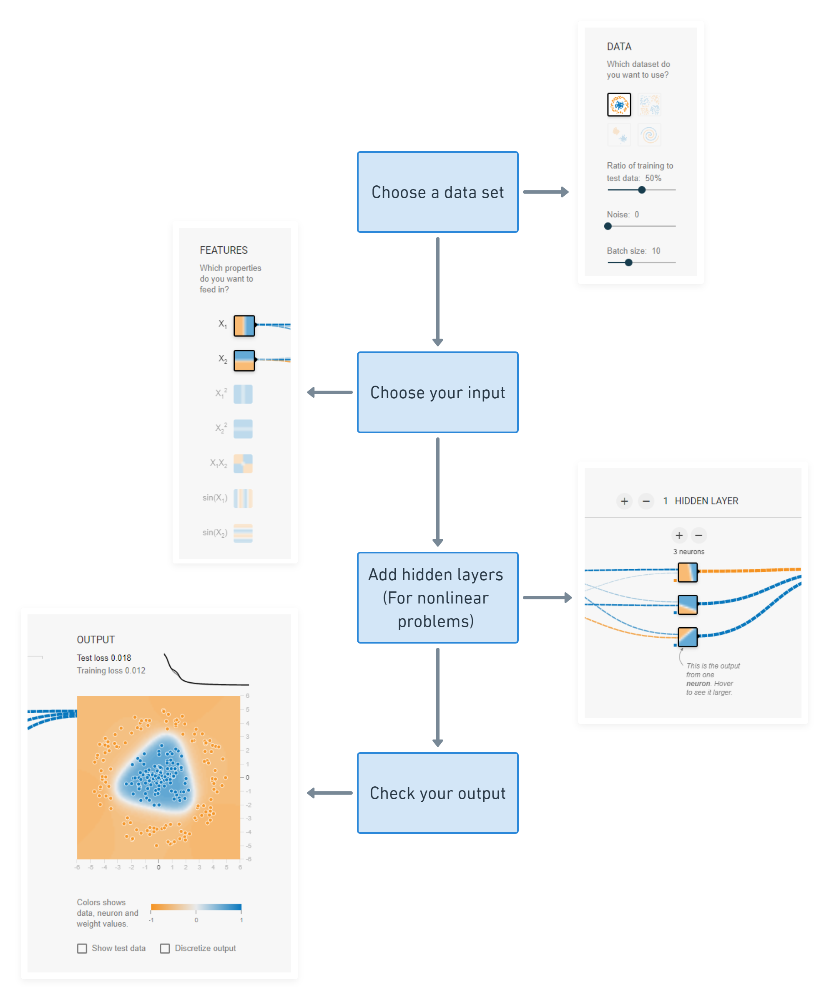
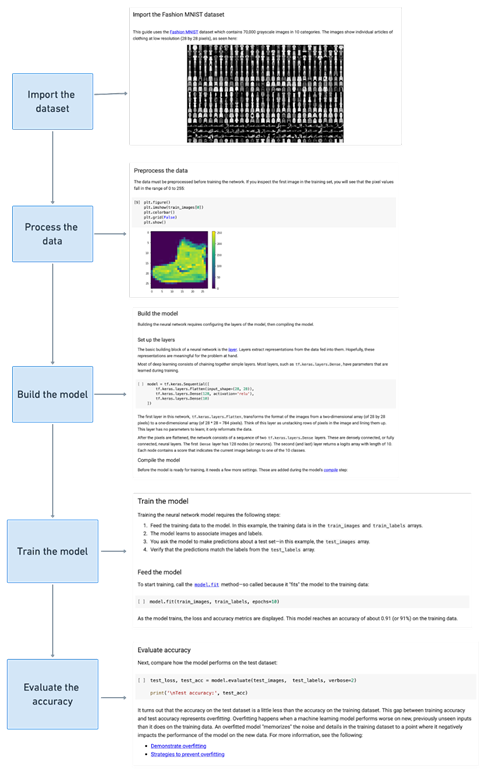
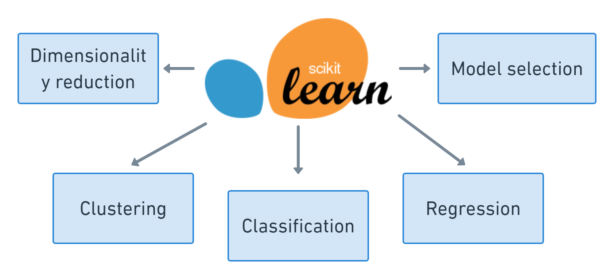
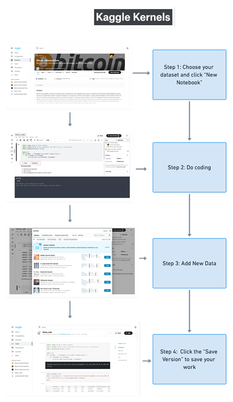

# Table of Contents

### [1. Introduction](#Introduction)

### [2. Neural Network Playground](#Neural-Network-Playground)

### [3. TensorFlow](#TensorFlow)

### [4. PyTorch](#PyTorch)

### [5. Eli5](#Eli5)

### [6. SciPy](#SciPy)

### [7. Statsmodel](#Statsmodel)

### [8. SKlearn (scikit-learn)](#SKlearn-(scikit-learn))

### [9. Keras](#Keras)

### [10. FinTA](#FinTA)

### [11. Kaggle Kernel](#Kaggle-Kernel)

# Introduction
In this instruction document, we introduce 11 useful tools for Economics: Neural Network Playground, TensorFlow, PyTorch, Eli5, Scipy, Statsmodel, Pingouin, SKlearn (scikit-learn), Keras, FinTA, and Kaggle Kernel. Basic information is provided for every tool, including introduction, license, required citation for this tool. Also, we provide examples for three of the tools: TensorFlow, SKlearn and Kaggle Kernel. We hope this project would be helpful for those who want to conduct machine learning and statistical analysis in the field of economics.

# Neural Network Playground
## 1. Introduction
[Neural Network Playground](http://playground.tensorflow.org/#activation=tanh&batchSize=10&dataset=circle&regDataset=reg-plane&learningRate=0.03&regularizationRate=0&noise=0&networkShape=4,2&seed=0.40061&showTestData=false&discretize=false&percTrainData=50&x=true&y=true&xTimesY=false&xSquared=false&ySquared=false&cosX=false&sinX=false&cosY=false&sinY=false&collectStats=false&problem=classification&initZero=false&hideText=false) is a web app written in JavaScript running in your browser. It lets you play with a real neural network and visualize it ([Sato](https://cloud.google.com/blog/products/ai-machine-learning/understanding-neural-networks-with-tensorflow-playground), 2016). Check its [Github repo](https://github.com/tensorflow/playground) for more details

## 2. License
Neural Network Playground is a Free/Open Source software, released under the terms of the Apache-2.0 License.
## 3. Required Citation
M. Abadi, A. Agarwal, P. Barham, E. Brevdo, Z. Chen, C. Citro, G. S. Corrado, A. Davis, J. Dean, M. Devin, S. Ghemawat, I. Goodfellow, A. Harp, G. Irving, M. Isard, Y. Jia, R. Jozefowicz, L. Kaiser, M. Kudlur, J. Levenberg, D. Man´e, R. Monga, S. Moore, D. Murray, C. Olah, M. Schuster, J. Shlens, B. Steiner, I. Sutskever, K. Talwar, P. Tucker, V. Vanhoucke, V. Vasudevan, F. Vi´egas, O. Vinyals, P. Warden, M. Wattenberg, M. Wicke, Y. Yu, and X. Zheng. TensorFlow: Large-scale machine learning on heterogeneous systems, 2015. Software available from tensorflow.org.
## 4. Example

Figure 1: Neural Network Playground Example 

# TensorFlow
## 1. Introduction
[TensorFlow](https://www.tensorflow.org) is a free and open-source software library for machine learning. It can be used for solving a range of tasks but has a particular focus on training and inference of deep neural networks. 

## 2. License
TensorFlow is a Free/Open Source software, released under the terms of the Apache License 2.0.
## 3. Required Citation
M. Abadi, A. Agarwal, P. Barham, E. Brevdo, Z. Chen, C. Citro, G. S. Corrado, A. Davis, J. Dean, M. Devin, S. Ghemawat, I. Goodfellow, A. Harp, G. Irving, M. Isard, Y. Jia, R. Jozefowicz, L. Kaiser, M. Kudlur, J. Levenberg, D. Man´e, R. Monga, S. Moore, D. Murray, C. Olah, M. Schuster, J. Shlens, B. Steiner, I. Sutskever, K. Talwar, P. Tucker, V. Vanhoucke, V. Vasudevan, F. Vi´egas, O. Vinyals, P. Warden, M. Wattenberg, M. Wicke, Y. Yu, and X. Zheng. TensorFlow: Large-scale machine learning on heterogeneous systems, 2015. Software available from tensorflow.org.
## 4. Example
Figure 2 presents  how to classify images of clothing by TensorFlow. The example is provided by the [TensorFlow official website](https://www.tensorflow.org/tutorials/keras/classification). 

Figure 2: TensorFlow Example: Classify images of clothing

# PyTorch
### 1. Introduction
[PyTorch](https://pytorch.org/) is an open source machine learning library based on the Torch library. It can be used for applications such as computer vision and natural language processing (NLP).
### 2. License
PyTorch is a Free/Open Source software, released under BSD. 
### 3. Required Citation
Paszke, A., Gross, S., Massa, F., Lerer, A., Bradbury, J., Chanan, G., Chintala, S. PyTorch: An Imperative Style, High-Performance Deep Learning Library. In Advances in Neural Information Processing Systems 32 (pp. 8024–8035). Curran Associates, Inc. 2019. Retrieved from http://papers.neurips.cc/paper/9015-pytorch-an-imperative-style-high-performance-deep-learning-library.pdf 
### 4. Example
Figure 3 demonstrate how we create the game tree successfully and solve for the equilibrium.

# Eli5
### 1. Introduction
[ELI5](https://eli5.readthedocs.io/en/latest/overview.html) is a Python library which allows users to visualize and debug various Machine Learning models using the unified API. It has built-in support for several ML frameworks and provides a way to explain black-box models ([ELI5](https://eli5.readthedocs.io/en/latest/overview.html), 2017).

### 2. License
Eli5 is a Free/Open Source software, released under the BSD license. 
### 3. Required Citation
Angela Fan, Yacine Jernite, Ethan Perez, David Grangier, Jason Weston, Michael Auli. ELI5: Long Form Question Answering, Proceedings of ACL 2019. 

# SciPy
### 1. Introduction
[SciPy](https://scipy.org/) is a free and open-source Python library that can be used for scientific and technical computing.

### 2. License
Eli5 is a Free/Open Source software, released under BSD-new license.
### 3. Required Citation
Pauli Virtanen, Ralf Gommers, Travis E. Oliphant, Matt Haberland, Tyler Reddy, David Cournapeau, Evgeni Burovski, Pearu Peterson, Warren Weckesser, Jonathan Bright, Stéfan J. van der Walt, Matthew Brett, Joshua Wilson, K. Jarrod Millman, Nikolay Mayorov, Andrew R. J. Nelson, Eric Jones, Robert Kern, Eric Larson, CJ Carey, İlhan Polat, Yu Feng, Eric W. Moore, Jake VanderPlas, Denis Laxalde, Josef Perktold, Robert Cimrman, Ian Henriksen, E.A. Quintero, Charles R Harris, Anne M. Archibald, Antônio H. Ribeiro, Fabian Pedregosa, Paul van Mulbregt, and SciPy 1.0 Contributors. (2020) SciPy 1.0: Fundamental Algorithms for Scientific Computing in Python. Nature Methods, 17(3), 261-272.

# Statsmodel
### 1. Introduction
[Statsmodels](https://www.statsmodels.org/) is a Python module that provides classes and functions for the estimation of many different statistical models, as well as for conducting statistical tests, and statistical data exploration ([Statsmodels](https://www.statsmodels.org/stable/index.html), 2021).

### 2. License
Statsmodel is a Free/Open Source software, released under modified (3-clause) BSD license.
### 3. Required Citation
Seabold, S., & Perktold, J. statsmodels: Econometric and statistical modeling with python. 2010. In 9th Python in Science Conference.

# Pingouin 
### 1. Introduction
[Pingouin](https://pingouin-stats.org/index.html) is an open-source statistical package written in Python 3 and based mostly on Pandas and NumPy ([Pingouin](https://pingouin-stats.org), 2021). 

### 2. License
Pingouin is a Free/Open Source software, released under GPL-3.0 License. 
### 3. Required Citation
Vallat, R. (2018). Pingouin: statistics in Python. Journal of Open Source Software, 3(31), 1026, https://doi.org/10.21105/joss.01026

# SKlearn (scikit-learn)
### 1. Introduction
[Scikit-learn](https://scikit-learn.org/stable/) is a free Python module for machine learning built on top of SciPy. 

Figure 3: Neural Network Playground Example

### 2. License
Scikit-learn is open source and free to use under the New BSD License.
### 3. Required Citation
Scikit-learn: Machine Learning in Python, Pedregosa et al., JMLR 12, pp. 2825-2830, 2011.
### 4. Example
Figure 2 shows how scikit-learn can be used to recognize images of hand-written digits, from 0-9. Check [Colab Notebook: scikit-learn hand-written digits recognition](https://github.com/SciEcon/Intelligent-Economics/blob/main/project3/plot_digits_classification.ipynb) for more details.

Figure 4: Neural Network Playground Example 

# Keras
### 1. Introduction
[Keras](https://keras.io/) is an open-source software library that provides a Python interface for artificial neural networks ([Keras](https://keras.io), n.d.). Keras acts as an interface for the TensorFlow library.

### 2. License
Scikit-learn is open source and free to use under the MIT License.

### 3. Required Citation
Chollet, F., & others. (2015). Keras. GitHub. Retrieved from https://github.com/fchollet/keras

# FinTA
### 1. Introduction
[FinTA (Financial Technical Analysis)](https://pypi.org/project/finta/0.3.3/) is a python package which provides common financial technical indicators implemented in Pandas ([FinTA](https://pypi.org/project/finta/0.3.3/), 2018).
### 2. License
FinA is open source and free to use under LGPL-3.0 license. 
### 3. Required Citation
Pauli Virtanen, Ralf Gommers, Travis E. Oliphant, Matt Haberland, Tyler Reddy, David Cournapeau, Evgeni Burovski, Pearu Peterson, Warren Weckesser, Jonathan Bright, Stéfan J. van der Walt, Matthew Brett, Joshua Wilson, K. Jarrod Millman, Nikolay Mayorov, Andrew R. J. Nelson, Eric Jones, Robert Kern, Eric Larson, CJ Carey, İlhan Polat, Yu Feng, Eric W. Moore, Jake VanderPlas, Denis Laxalde, Josef Perktold, Robert Cimrman, Ian Henriksen, E.A. Quintero, Charles R Harris, Anne M. Archibald, Antônio H. Ribeiro, Fabian Pedregosa, Paul van Mulbregt, and SciPy 1.0 Contributors. (2020) SciPy 1.0: Fundamental Algorithms for Scientific Computing in Python. Nature Methods, 17(3), 261-272.

# Kaggle Kernel 
### 1. Introduction
[Kaggle](https://www.kaggle.com) Kernels are essentially Jupyter notebooks in the browser, which means that users can save themselves the hassle of setting up a local environment, and have a Jupyter notebook environment inside the browser ([Yufeng](https://towardsdatascience.com/introduction-to-kaggle-kernels-2ad754ebf77), 2017).
### 2. License
FinA is open source and free to use under LGPL-3.0 license. 
### 3. Required Citation
### 4. Example
Figure 5 shows an example of Kaggle Kernel to do data processing and simple machine learning based on the dataset on Kaggle. Check [this example](https://www.kaggle.com/chenyuwangcw417/demo-code) for more details. 

Figure 5: Kaggle Kernel Example

# Case Studies
In this section, we provide three case studies for TensorFlow, Scikit-Learn, and Kaggle Kernel. [The case of TensorFlow](https://www.tensorflow.org/tutorials/keras/classification) is provided by the TensorFlow official website, which trains a neural network model to classify images of clothing; [The case of Scikit-Learn](https://github.com/SciEcon/Intelligent-Economics/blob/main/project3/plot_digits_classification.ipynb) shows how scikit-learn can be used to recognize images of hand-written digits, from 0-9; [The case of Kaggle Kernel](https://www.kaggle.com/chenyuwangcw417/kaggle-kernel-example) presents how to do data processing and machine learning based on the Kaggle dataset related to Bitcoin. By time series algorithm, we can predict the Bitcoin prices according to the previous ones. 
