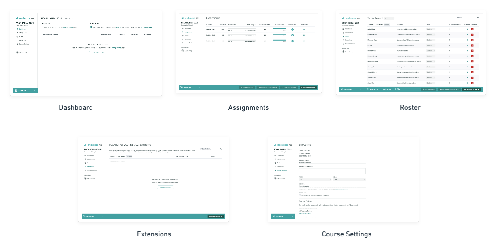
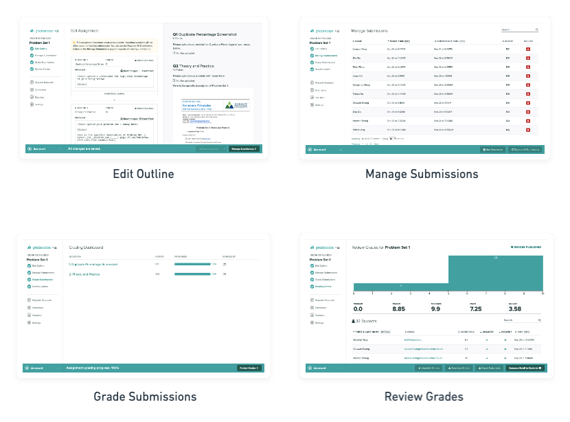
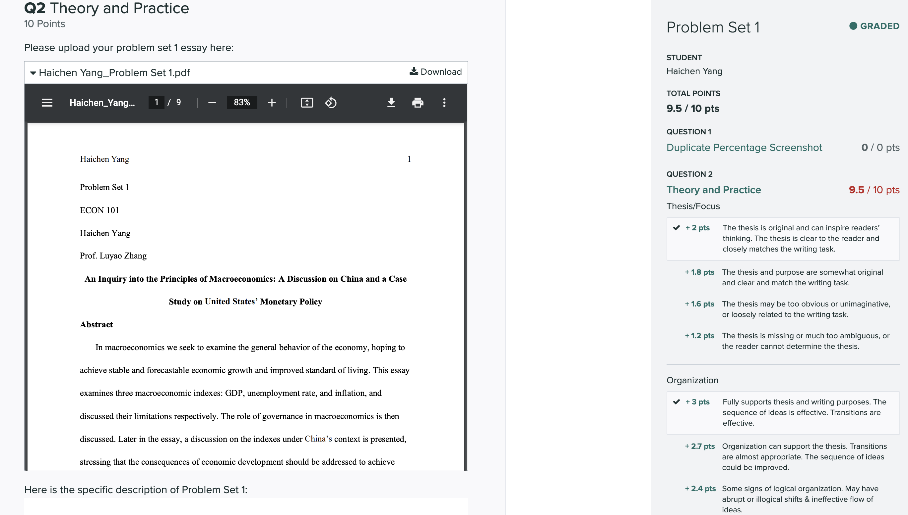

# About 
We used Gradescope for both Essay and Code Assignments for two courses at Duke Kunshan University in Autumn 2021. In Econ 101 Economic Principles, we implement three essay assignments, and in Econ 211 Intelligent Economics: An Explainable AI Approach, we implement three essay assignments and one code assignment. In the user cases, we integrate Gradescope to Sakai, the Learning Management System (LMS) adopted at both Duke University and Duke Kunshan University. In this article, we summarize the Gradescope resources, user experience, and reflections for the future of gradings.

Illustrator in Whimsical Folder: [URL]（https://whimsical.com/project-5-Qimv14W7pzLGcQkLCZDnMM）

# Table of Contents

### [1. Introduction to Gradescope Resources](#Introduction-to-Gradescope-Resources)

### [2. How Gradescope: A step-by-step guide](#How-Gradescope-A-step-by-step-guide)

### [3. Pros and Cons](#Pros-and-Cons)
 
### [4. Essay Assignment](#Essay-Assignment)

### [5. Code Assignment](#Code-Assignment)

### [6. The future of grading](#The-future-of-grading)

# Introduction to Gradescope Resources

## About Gradescope
[Gradescope](https://www.gradescope.com/) can help the instructor to properly administer and grade all of the assessments, no matter online or in-class. It is designed to save grading time by enabling scalable assessment in different subjects, including Computer Science, Economics, Mathematics, Engineering, etc ([Singh et al, 2017](https://dl.acm.org/doi/pdf/10.1145/3051457.3051466)). It creates a platform for the instructor to make a profile of all the assignments that have been designed, including exams, homework, and codes. At the same time, it supports [a quick and flexible grading experience](https://learninginnovation.duke.edu/gradescope/) by applying detailed feedback with a simple click. Moreover, Gradescope also supports visualization of the rubric level and overall statistics to better understand the students’ progress. This platform also explores the potential [AI-assisted grading experience](https://help.gradescope.com/article/mv8qkiux00-instructor-assignment-ai-grading-answer-groups) by applying Natural Language Processing techniques to classify the students’ assignments and thus enable the instructor to grade by groups. Overall, this platform optimizes the grading experiences and makes the hands-on experience more efficient.　

## Gradescope Resources
- Gradescope Official Website: https://www.gradescope.com/
- Gradescope YouTube Channel: https://www.youtube.com/user/Gradescope/featured
- Gradescope at Duke: https://learninginnovation.duke.edu/gradescope/
- Gradescope help center: https://help.gradescope.com/
- Student Center: https://help.gradescope.com/category/cyk4ij2dwi-student-workflow
- FAQs: https://help.gradescope.com/category/czisb9ar5e-faq
- Using Gradescope with Sakai as an Instructor: https://help.gradescope.com/article/4sma4yasea-sakai-instructor
- Using Gradescope with Sakai as a Student: https://help.gradescope.com/article/vjya9v6fb1-sakai-student

# How Gradescope: A step-by-step guide

<!--  -->

<b>Figure 1: The Gradescope <a href= "https://help.gradescope.com/category/nvr9q1hik4-instructor-course-workflow">Pipeline </a></b>

Create by <a href= "https://whimsical.com/gradescope-H4ZW3cax6Tz15ugPrGZzfG@2Ux7TurymNJZpD75oDUj">whimsical </a>

<!-- ***Figure 1: The Gradescope Pipeline*** -->

By enabling Gradescope as a tool in [Learning Management Systems (LMSs)](https://help.gradescope.com/category/neowy136jk-lms-workflow), such as [Sakai](https://help.gradescope.com/article/4sma4yasea-sakai-instructor), the instructor and students can directly have the access to Gradescope website for assignment submission and grading. For the instructor, through syncing the Sakai course site to the corresponding Gradescope course, rosters and future grade posting will be automatically implemented from Gradescope to Sakai. After the sync is done, instructors can start to set up Gradescope assignments according to their demands, such as problem sets, quizzes, code assignments, or other customized homework formats created by beta version, where it also allows individual or group submission. After the deadline, the instructor can start to grade students’ submissions based on imported or designed rubrics, and it can be synced directly with the corresponding assignment in Sakai, thus students can check their grades either from Sakai or Gradescope. Every submission will be evaluated on an individual basis properly, with clear comments and grades based on rubrics. It is also convenient for students to check their grades and feedback directly from Gradescope.

# Pros and Cons

## Summary:

Gradescope is generally a user-friendly integrated platform for assignment submission and grading. For example, [Yen et al (2020)](https://dl.acm.org/doi/pdf/10.1145/3386527.3406748) point out that Gradescope helps the instructor to reduce the grading times of short-answer problems to a large extent. We have also figured out several pros and cons in experiential learning of acting the roles of students, Teaching Assistants (TAs), and instructors. We highly appreciate the integrated functionality of Gradescope but also identify issues for further improvements.

## Pros:

1. **The integrated functionalities**: Gradescope allows instructors/TAs to 

- upload assignments and attachments;
- set up sub-questions and specific answer positions with the beta version;
- upload grading rubrics, grade by rubrics, and add additional comments;
- review, post, and export grades;
- provide instant feedback to students;
- receive [regrade requests](https://help.gradescope.com/article/8hchz9h8wh-student-regrade-request) from students.

2. **Free access and connection with a broad range of Learning Management Systems (LMS), such as [Sakai](https://sakai.duke.edu/)**: Gradescope is connected with Sakai, which allows posting grades to Sakai with just one click.

3. **User-friendly operations**: The web pages of Gradescope are clear and instructive. Users can easily customize the assignments and grading procedure.

## Cons:

1. **Rubrics uploading**: The grading rubrics can only be uploaded after at least one submission of the assignment. And the rubrics cannot be replicated from another assignment.

2. **Auto-grading tools**: It is a bit complicated to implement auto-grading tools to grade the assignments.

3. **Complex assignment grading**: Complex assignment grading can only be done by setting sub-questions. And there are no logic settings within the sub-questions.

# Essay Assignment

In the course Econ101 Economic Principles, Autumn 2021, Session 1 at Duke Kunshan University, we use Gradescope for 3 Essay Assignments. In the Assignments, students are asked to submit the PDF of the essay, along with [Grammarly](https://www.grammarly.com/) Screenshot and [Turnitin](https://www.turnitin.com/zh-hans) duplicate checking screenshot as prerequisites for grading. 

In general, we ask students to submit their assignments to Gradescope and we use it for grading. Figure 2 shows some general functions of Gradescope that we have utilized:

<!--  -->

<b>Figure 2: 5 General Functions in Gradescope</b>

Create by <a href= "https://whimsical.com/figure-2-5-general-functions-in-gradescope-XdmMm4dtApMVtJsegtSH9M@2Ux7TurymMrm1o2PJK2s">whimsical </a>

<!-- ***Figure 2: 5 General Functions in Gradescope*** -->

There are 5 functional pages in Gradescope:

- **Dashboard (visible in student view)**: Allows students and instructors to view the active assignments and course description.
- **Assignments (invisible in student view)**: Allows instructors and TAs to check the status of the assignments.
- **Roster (invisible in student view)**: Allows instructors and TAs to add or delete course members.
- **Extensions (invisible in student view)**: Allows instructors and TAs to add specific time extensions to assignments.
- **Course Settings (invisible in student view)**: Allows instructors and TAs to set up the course and customize the grading styles.

In each assignment, we use the [beta version](https://help.gradescope.com/article/gm5cmcz19k-instructor-assignment-online) to add sub-questions under one assignment. Figures 3 shows the functionality of Gradescope in grading assignments:

<!--  -->

<b>Figure 3: 4 Grading Functions in Gradescope</b>

Create by <a href= "https://whimsical.com/figure-3-4-grading-functions-in-gradescope-8CQrG1KBRyC3icgTaRSxrj@2Ux7TurymNCqvn8Vaw6N">whimsical </a>

<!-- ***Figure 3: 4 Grading Functions in Gradescope*** -->

There are 4 functional pages in each assignment grading process that are not visible in student view:

- **Edit Outline**: Allows instructors and TAs to edit the questions of the assignments.
- **Manage Submissions**: Allows instructors and TAs to view the information of the submissions and review or delete any submission.
- **Grade Submissions**: Allow instructors and TAs to view the submission under each sub-question.
- **Review Grades**: Provides statistics of the grading and allows instructors or TAs to review the assignments.

<!--  -->

<b>Figure 4: Grading with rubrics in Gradescope</b>

Create by <a href= "https://whimsical.com/figure-4-AJ3X7vxx9CXuoSUvxYCBpD@2Ux7TurymNBkCDYxMv6D">whimsical </a>

<!-- ***Figure 4: Grading with rubrics in Gradescope*** -->

Figure 4 shows how instructors and TAs are able to grade the assignments with grading rubrics.

Pros:
1. **Clear rubrics feedback**: Students are able to get detailed feedback according to the grading rubrics and any extra comments.

2. **Specific answer position**: TAs and instructors can set up specific answer formats and the students can tag their answers in a certain place, which reduces the complexity in assignment grading.

Cons:
1. **Low tolerance for large files**: Gradescope requires instructors/TAs to download the large files for view, and it would cause some trouble when grading.

2. **Comments on certain positions in the essay**: Gradescope does not allow instructors/TAs to address in-text comments in certain positions.

3. **Unable to check duplicate results directly**: Even though Turnitin and Gradescope are [two services from the same company](https://www.turnitin.com/press/turnitin-acquires-gradescope), there is still no interface connected between these two services to enable instructors to check duplicate results directly. 

# Code Assignment

In the course Econ 211 Intelligent Economics: An Explanable AI Approach, Autumn 2021, Session 2 at Duke Kunshan University, we use Gradescope for 3 Essay Assignments. In the Assignments, students are asked to upload the PDF of the Python Notebook, especially [Colab](https://research.google.com/colaboratory/), with all the math formulas and visualization generated for grading.

Pros: 

**Handy [code similarity check](https://help.gradescope.com/article/3vr6x46ppn-instructor-assignment-programming-code-similarity)**: Code Similarity helps to determine how students’ codes are similar to each other. It does not demonstrate whether plagiarism exists but rather shows you to what extent two programs are similar to each other. At present, it supports the following coding languages: C, C++, C#, F#, Go, Java, JavaScript, Matlab, MIPS, ML, Python, and R.

Cons: 
1. **Code editing environment not provided**:
Gradescope does not provide an online editing environment like Google Colab. In other words, Gradescope does not allow students to edit coding assignments directly on its platform. Therefore, what we did is to provide a Google Colab template for students to download and after they finish coding in their own environments, they need to upload the file again to Gradescope for grading.

2. **Rubrics cannot be uploaded without a sample answer**:
Gradescope does not allow the editors to generate rubrics unless a sample answer is uploaded.

3. **It is not a great way for grading assignments containing both code and text**:
Gradescope provides an interface to let you write your own auto-grader for grading coding assignments. However, lots of Data Science related assignments are not proper to use as an auto-grader, because the code is used for solving a specific problem in many cases. Therefore, you are not able to use different inputs to test the universality of the code.

# The future of grading
**Helen Papagiannis (2017) says in her book** ***[Augmented Human: How Technology Is Shaping the New Reality](https://www.amazon.com/Augmented-Human-Technology-Shaping-Reality/dp/1491928328)***: “When we move away from copying reality, AR, in general, will be liberated from the burden of simulating the real, with the creative doors wide open to new modes of expression and invention.” We believe the future of grading shall be at the interplay of Artificial Intelligence and Human Intelligence, i.e., a higher level of automation, humanity, and intelligence.  

1. **Automation**: We can implement [smart contracts](https://www.investopedia.com/terms/s/smart-contracts.asp) for an automated pipeline of duplication audit, prerequisite scrutiny, and auto-grading. 

2. **Humanity**: We can make the technology more inclusive by providing an empathetic user experience for instructions, TAs, and students with not a strong technical background. 

3. **Intelligence**: We can utilize [asymmetric cryptography](https://www.sciencedirect.com/topics/computer-science/asymmetric-cryptography) and [blockchain](https://www.investopedia.com/terms/b/blockchain.asp) technology to protect the privacy of students.

